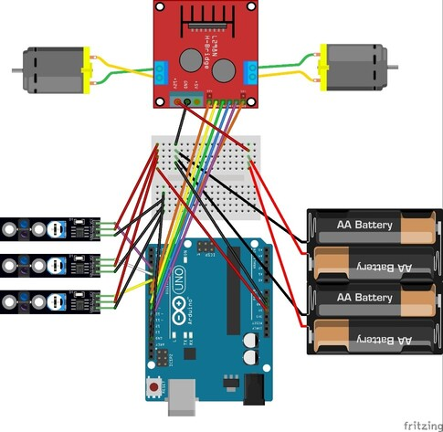

# Project Arduino Line Tracer

line tracer with two wheel and two motors included in L298N motor drive

### Abstract

이 프로젝트는 적외선 센서를 활용하여 아두이노 우노 보드로 라인 트레이서 RC카를 제작한 과정을 토대로 이에 필요한 기본 구성요소에 대한 설명과, 효과적이고 높은 정확도로 구동하는 내용을 포함한다.
설계 과정과 구동까지의 과정에서 생겼던 시행착오와 이를 해결하기 위해 문제점을 분석하고 해결방안에 도달하기 위해 하드웨어와 소프트웨어를 복합적으로 고려한 과정을 보여준다.
하드웨어적 문제를 소프트웨어 관점에서 해결하는 차별성을 가지고 있으며 최종 결과를 주행 영상과 회로도, 소스코드로 나타냈다. 

### Relevant background information

> 아두이노 우노(UNO) 보드

Open Source를 기반으로 한 단일보드로 간단한 MCU(MicroController)와 관련된 개발 환경을 제공한다.
MCU란 마이크로프로세서와 입출력 모듈을 하나의 칩으로 만들어 특정 기능을 수행하는 작은 컴퓨터를 말한다.
아두이노는 다수의 스위치나 센서로부터 값을 받아들여 외부 전자 장치들을 통제함으로써 환경과 상호작용이 가능한 물건을 만들어 낼 수 있다는 장점이 있다.

> 적외선 센서

 

적외선을 방출하고 반사되어 돌아오는 양을 측정하기 때문에 장애물의 존재 유무와 색상까지 판별할 수 있다.
발광부, 수신부, 가변저항으로 구성되어 있다. 발광부에서 적외선을 발신하면 수신부에 들어오는 적외선의 여부를 통해 입력값을 결정하고 가변저항을 통해 측정 거리를 조절할 수 있다. 
가변저항의 감도 조절부를 시계 방향으로 돌리면 감지 거리가 증가하고, 반시계 방향으로 돌리면 감지 거리가 감소한다. 
흰색 면에서는 적외선이 반사되고 검정색 면에서는 적외선이 흡수된다. 해당 프로젝트에서 검정색 라인을 감지하면 1의 신호를, 감지되지 않으면 0의 신호를 출력하도록 하였다.
적외선 센서의 VCC와 GND 핀은 각각 전원과 Ground를 입력 받고, 나머지 SIG핀은 신호를 받고자하는 아두이노의 핀과 연결하였다.

> DC모터

전력 소비와 소음이 낮고 속도 제어가 세밀하게 가능하지만 AC모터보다 수명이 짧고 힘이 약해 단시간 사용하기에 적합하다.
(+)와 (-)의 방향을 바꾸게 되면, 즉 건전지를 거꾸로 돌리면 방향이 반대로 돌아가는 것을 볼 수 있다. 이러한 점을 이용하여 모터의 방향을 바꾸며 RC카를 구동할 수 있다.

> L298N 모터 드라이버

모터의 속도를 제어하고 회전 방향을 제어할 수 있는 회로 장치로서 아두이노 보드와 같은 MCU를 통해 사용할 수 있는 드라이버이다. 
DC모터 2개 또는 스테핑 모터를 연결하여 제어가 가능하며, 입력 전압은 12V 또는 5V로 사용할 수 있고 그 사이에 GND 핀이 위치해 있다.
모터 제어시 전류가 사용되는데 우리가 사용하는 아두이노 우노 보드에서 출력하는 전류는 모터에서 필요한 전류보다 낮아 드라이버 모듈 없이 구동할 시 보드가 파손될 수 있다. 
L298N에는 모터A와 B를 출력하는 OUT핀이 있으며 enA, enB 핀을 통하여 모터 속력을 조정하고 Input 핀을 통해 모터의 방향을 조절한다.

In1과 In2의 입력에 따라 모터의 회전 방향이 달라진다.

### Fritzing Schematic

L298N motor driver에 dc모터 2개를 연결하고 3개의 적외선 센서와 아두이노 우노 보드를 연결하여 RC카 회로를 구성했다.

### Arduino Sketch Source Code

[code link](https://github.com/seocord/Line-Traker-car-with-Arduino/blob/3a9c3d84825abf4c173943f96f671d8ec4ae6197/lineTrakerRCcar.ino)

### Result

15.93s 소요

### Theoretical Development

- 적외선 센서의 라인 인식 문제

line tracer란 라인을 인식하는 용도로 사용하는 적외선 송수신 센서 모듈로 OUT 핀을 통해 아날로그, 디지털 값으로 출력이 가능하다. 
해당 프로젝트에서 적외선 센서는 라인을 인식하여 검정색인 경우 1, 그 외에는 0을 출력하여 이를 바탕으로 소스 코드를 작성하였다.
트랙의 라인과 적외선 센서 사이의 거리에 해당하는 적절한 거리로 감도조절부를 조정하고 코드에서 세 개의 적외선 센서가 모두 트랙을 벗어난 경우인 '000'에서
직진을 후진으로 변경하여 트랙을 벗어나지 않는 정확도를 높이고자 수정했다. 

- 속도 제어 한계의 문제

line tracer가 직진 구간뿐만 아니라 커브 구간도 안정적으로 주행하기 위해서는 적당한 속도 제어가 필수적인데 해당 프로젝트에서 사용한 RC카의 특정 한 쪽의 속도가
130 이하로 제어할 경우 작동을 멈추는 현상이 발생하였다. 정확한 원인은 아직도 찾지 못하였으나 여러 번 시도해보면서 특정 구간에서만 모터가 정상적으로 작동하는 것을 발견하였다. 
이때 양쪽 바퀴의 속도를 맞춰주지 않으면 한 쪽으로 쏠리는 현상이 발생하기 때문에 양쪽 모터의 속도를 맞춰주는 과정이 어려웠다. 또한 한 쪽으로 회전하는 현상을 줄이기 위해서 
RC카 차체의 무게도 적당히 맞춰줘야 했으며 차체 위 회로나 모터 드라이버, 9V 배터리를 중심축에 가깝도록 배치하였다.
다양한 변수가 존재할 수 있기에 안정적인 주행을 할 수 있는 소스 코드 구현에 집중하였다. 

### Conclusing with discussion

